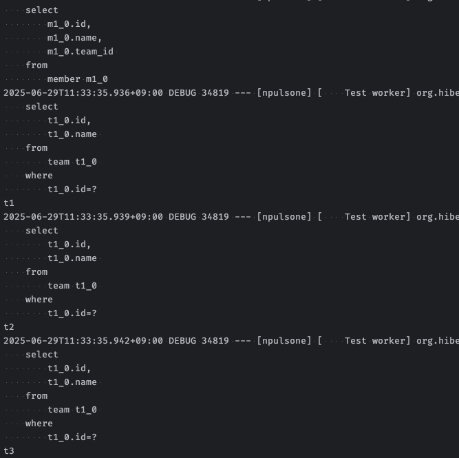
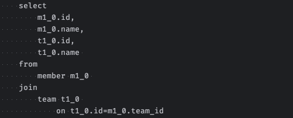
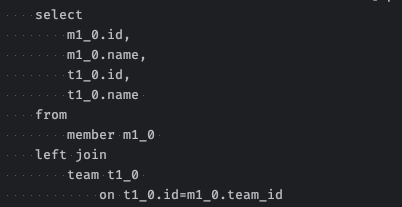
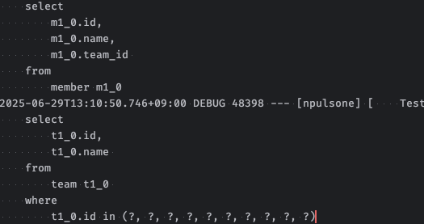

# 상황
- Member - Team = N : 1 관계
- 3명의 회원이 각각 3팀에 가입되어 있는 상황

## N + 1 발생 - `findAll()`
- 모든 멤버를 조회할 때 1번의 멤버 전체 조회 쿼리와 각 멤버의 팀에 접근하기 위에 3번의 쿼리가 더 발생함.

## N + 1 해결
### Fetch Join - `findAllByFetchJoin()`

### EntityGraph - `findAllByEntityGraph()`

### BatchSize
